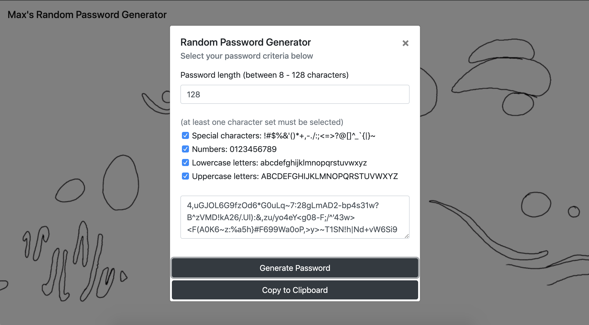

# HW3
password generator

This is my take on a random password generator. The form generally follows the parameters defined in the homework description, with a few deviations:

- instead of prompts/confirms, I used a modal form. I implemeneted the prompts/confirms initially, but found them awkward and cumbersome from a user perspective, and felt like a single interface where a user could see all of the options at once, change their mind etc was a more useful and practical way to do it.

- additionally, I wanted a user to be able generate multiple passwords in a row using the same criteria, without having to restart the process. Or, in another potential use case, change one of the character sets, or the length of the password, without having to start from the beginning of the process each time.

I really enjoyed the back end design of this assignment. I truly love function writing, and after talking with a few of my classmates, i think i probably overengineered this assignment, at least from a requirements point of view.

My basic approach was to write a bunch of small discrete functions that each do one specific part of the process, as opposed to a few large functions that do multiple operations. I wrote from the ground up, or from the most micro to the most macro. the general flow looks like this:

                                        User Input(the modal form)
                                             |
                                          Governor(form inputs)
                                             |
                                        ObjectMaker(form inputs)
                                             |
                                         Generator(object)
                                        /    |    \
                            StringMaker(array) <-- ArrayMaker(object)
                                        \    |    /
                                         Randomizer(string, array)
                                             |
                          (randomizer generates the actual password)
                                             |
                                        Validator(password)
                                             |
                                        Contains(password)

So the user only interacts with the governor function, which orchestrates the level below it, which in turn orchestrates the level below that, and so on. I found this approach much easier to debug and test, as well as to just concieve of the flow, track variables and returns etc. 

I am particularly happy with the fact that my generator will not return a password that does not satisfy the criteria selected by the user. While the correct length is quite simple to verify and match, i found when testing that for short passwords (8 characters) with all four character sets selected, somewhere around 40% of passwords returned were missing at least one character set. In particular, the numbers were underrepresented due to their being only 10 numeric characters as opposed the 26 of each letter set and 30 of the special set.

My mechanism for password validation i think is fairly elegant: i have a function called validator that loops through the randomly generated password, checking for at least one character from each selected set (using the contains function). If any of the contains returns are false, validator passes back the string "invalid", which gets passed through randomizer back up to generator. Generator, upon recieving "invalid", enters a while loop that will go until randomizer returns a password that has satisfied all selected criteria.

Upon review, I probably could have eleminated one step, either the object creation, or the array creation. I was attracted to the idea of each desired password being represented by an object, with each character set being a true or false key, and the length being an int key. this way, each password request could sort of be bundled up into a single variable and passed around the javascript and accessed when needed. If i had to do it again, i'd probably eliminate the array, but i'm not sure.

As for the front end, I wanted it to be fairly simple and straightforward. I didn't like the idea of having a box and checkboxes on the page itself, I wanted that stuff to come up only when needed, hence the modal. The animation in the background was just because I could do it, and I thought it looked cool. It's probably not a great idea in reality, I found it loading horribly slowly on my phone (although that could be partly the github hosting), and additionally, the user can actually access the animation loop as a video if they right click on it, which is probably not ideal. That being said, for the sake of the homework, i figured it would be ok, it looks cool and adds a little flair to an otherwise utilitarian piece of machinery.

One bug I still haven't figured out how to solve is that with nothing in the modal form selected, or with the length form selected, if the user hits enter, it closes the modal and clears all the forms. This seems to be some default behavior, and as of yet I haven't figured out how to disable it. It's a small thing, but it really bugs me.

Overall, really enjoyed this one.

Here's my screenshot:

